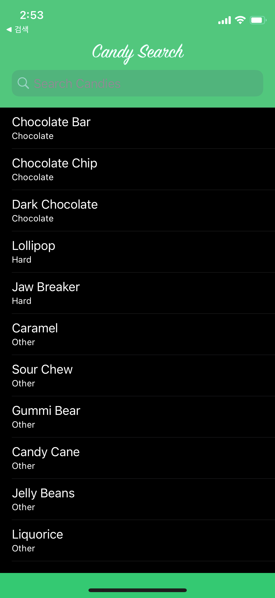
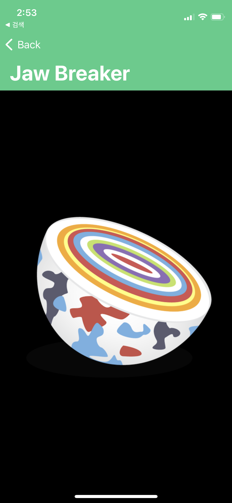
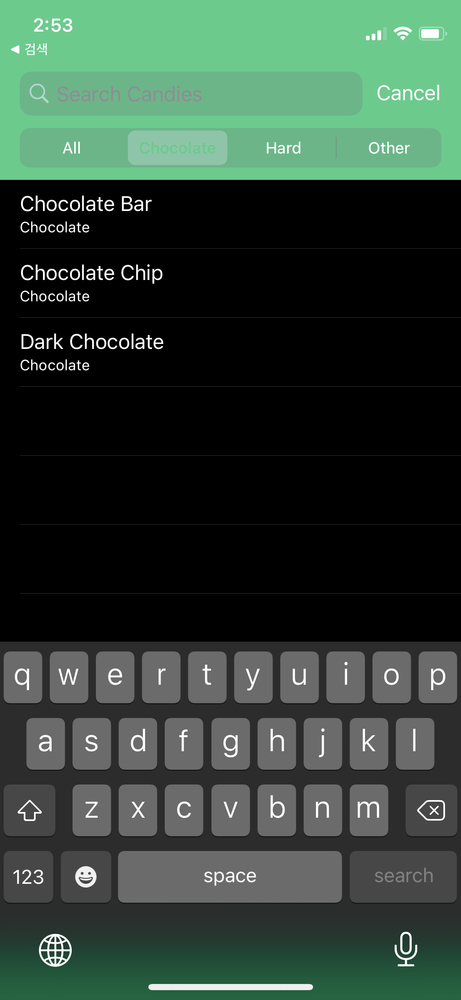
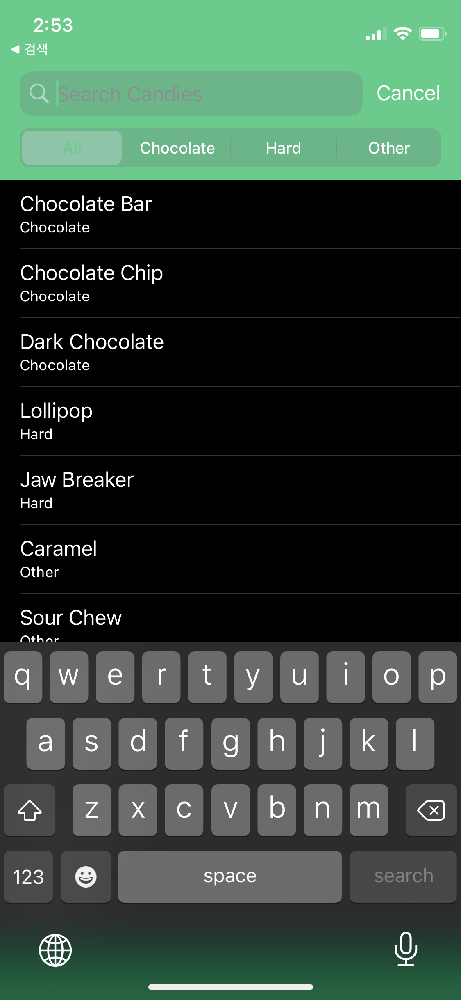
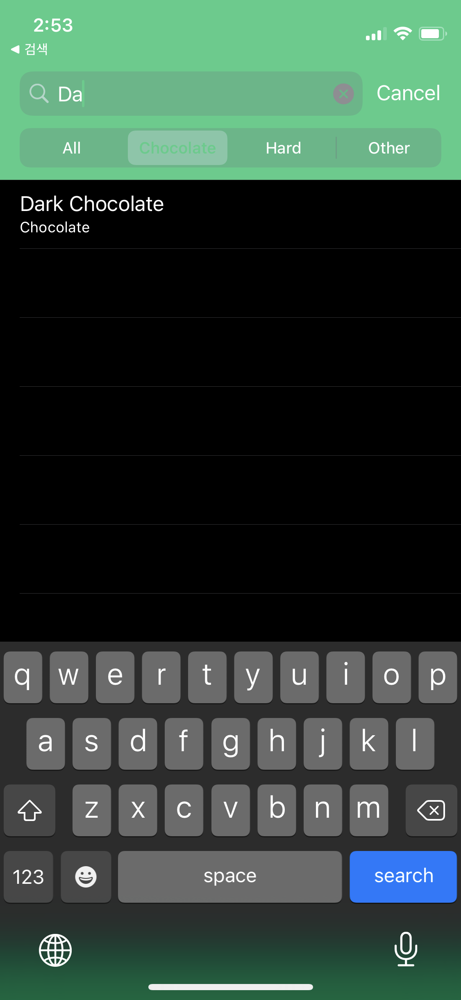

# [Swift-30-Projects] 06. IOS 클론코딩 CandySearch

테이블 뷰를 쓰다보면, 항상 검색하는 부분이 있는데 처음 이런 뷰를 보았을 때 `SearchController`를 몰라서 `textField`로 구현하려다가 대 망했던 기억이 있네요. 이 글을 보시는 분들 중 저와 같은 분이 계시다면 꼭 `SearchController`을 좀 더 살펴보시고 구현하는걸 추천 드립니다!

## 앱 구조
구조는 매우 심플 합니다. 메인 테이블 뷰와 디테일 뷰 두 개로 이루어져있습니다. 메인 테이블 뷰에는 서치컨트롤러가 있어서 검색 기능이 있습니다.

네비게이션 바의 색을 칠하는 방법은 [이전 프로젝트](https://dev200ok.blogspot.com/2021/05/swift-30-projects-05-ios-artistry.html)에서 익혔기 때문에 그대로 가져다 사용했습니다.




메인 페이지에 가운데 로고를 넣고, 서치컨트롤러를 넣는데 고생을 했습니다. 결론적으로 가운데로고는 네비게이션 아이템에 뷰를 넣어서 이미지를 넣었습니다. 그리고 서치 컨트롤러는
```
navigationItem.searchController = searchController
```
이렇게 넣어주었습니다.

그리고 그 아래에 이쁜 `scopeButton`은 처음 넣어 보는 것 이었는데, 아래 코드로 넣었습니다.
`searchController.searchBar.scopeButtonTitles = ["All", "Chocolate", "Hard", "Other"]`

이 색상을 입히는 작업이 생각보다 쉽지 않았는 커스텀한 설정을 넣는 방법이 익숙하지 않아서 그랬던 것 같습니다. 좀 더 쉬운 방법이 있다면 댓글로 알려주세요!

```
searchController.searchBar.setScopeBarButtonTitleTextAttributes([.foregroundColor: UIColor.candyGreen()], for:.selected)
searchController.searchBar.setScopeBarButtonTitleTextAttributes([.foregroundColor: UIColor.white], for:.normal)
```


## 필터, 검색기능
사실 데이터가 한정되어있는 상태이기 때문에 검색기능은 사실상 필터와 같습니다.

크게 2개를 구현해서 만든 기능인데,
하나는 UISearchResultsUpdating `delegate`를 구혀했습니다. 서치 컨트롤러가 업데이트 될 때마다, 필터가 동작하도록 구현하는 것
나머지 하나는 서치 컨트롤러에 입력된 값이 우리가 가지고 있는 데이터와 일치하는지를 비교하는 필터를 사용했습니다.

```
private func filterContentForSearchText(_ searchKeyword: String, scope: String = "All") {
   filteredCandies = candies.filter { candy in
       if scope != candy.category.rawValue && scope != "All" { return false }
       return candy.name.lowercased().contains(searchKeyword.lowercased()) || searchKeyword == ""
   }
   tableView.reloadData()
}
```




## 마무리

전체 코드는 [github](https://github.com/M1zz/CandySearch)에 올려놓도록 하겠습니다.
