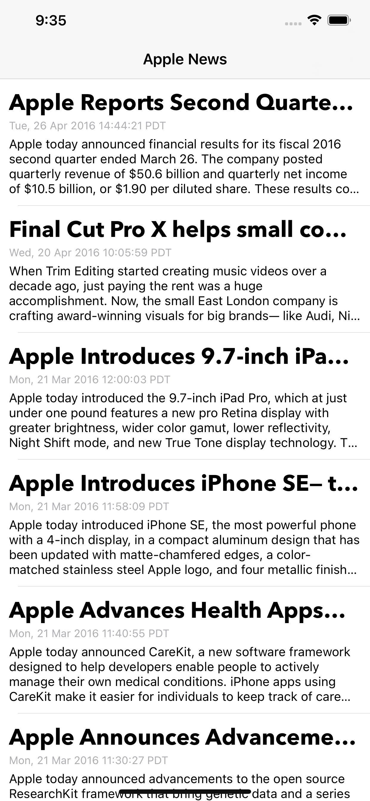
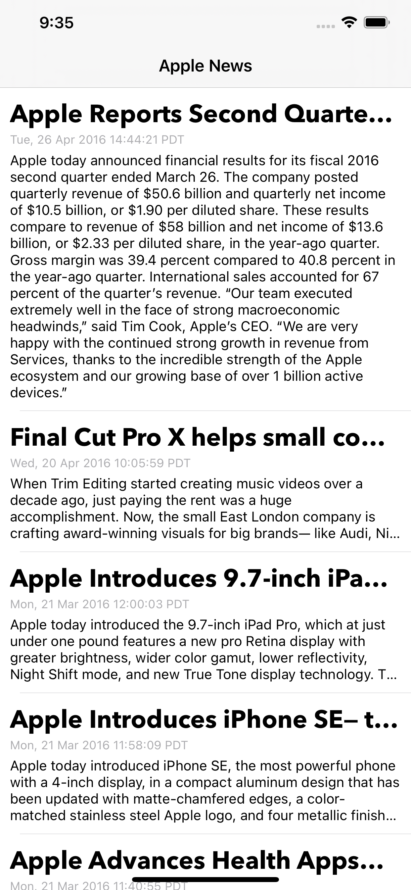

# [Swift-30-Projects] 08. IOS 클론코딩 SimpleRSSReader

테이블 뷰를 그리는데 매번 정형화된 데이터는 JSON 이었습니다. 그래서 이번에는 XML Parser를 이용해, RSS를 읽어오는 Reader를 만들었습니다.

## 앱 구조
테이블 뷰, 한 개의 화면으로 이루어진 앱 입니다. 기능 또한 심플합니다. rss요청에 대한 응답을 받아와 파싱해서 읽을 수 있게 나열해주는 것 입니다.

## 앱 구현 순서
구체적으로 나열하지 않아도, 여태까지 앱을 만들었던 순서는 항상 아래와 같았습니다. 앱을 여려개 만들다 보니 나름의 공정과정이 생긴 것 같습니다.

1. 와이어 프레임 및 동선구현 - 네비게이션 뷰, 상세, 팝업 페이지 구현
2. UI구현 - 필요한 뷰와 셀들을 구현해둡니다. 버튼을 배치 합니다.
3. 모델링 - 내가 필요한 데이터를 모델링 하고, 목 데이터를 만듭니다.
4. 기능 구현 - 목 데이터를 가지고 필요한 기능을 구현합니다
5. 네트워크 - 실제 필요한 데이터를 API를 통해 가져옵니다.
6. 에러 처리 - 네트워크 요청에 대한 실패 케이스를 정리해줍니다.
7. 기타 화면 작성 - 로딩 뷰, 데이터 없음, 에러 페이지 작성
8. 리팩토링 - 내가 작성한 코드가 읽기 쉽고, 확장성 있게 만들어 줍니다.

## 마무리

테이블 뷰와 관련된 앱만 여러개 만들다 보니 이제 좀 익숙 해졌습니다. 앱의 기초라 할 수 있는 테이블 뷰의 활용 방법에 대해 더 정리할 수 있는 기회가 있다면 다른 글에 적어놓도록 하겠습니다.

전체 코드는 [github](https://github.com/M1zz/SimpleRSSReader)에 올려놓도록 하겠습니다.
