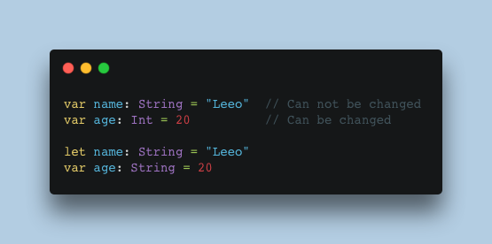

[002 Coding tip of the day - var vs let]
상수와 변수를 구분해주세요. 빌드에는 문제가 없지만, 그 의미가 다릅니다.
var로 선언되어있는 변수는 값이 변경될 여지가 있다는 뜻 입니다. 반대로 상수로 선언되어있다면, 변경되지 않는다는 뜻을 내포하고 있습니다.
좀 더 이해하기 쉬운 코드를 작성하는 좋은 습관 중 하나 입니다.

