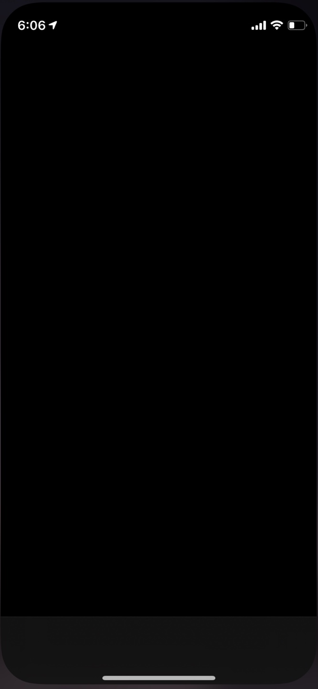
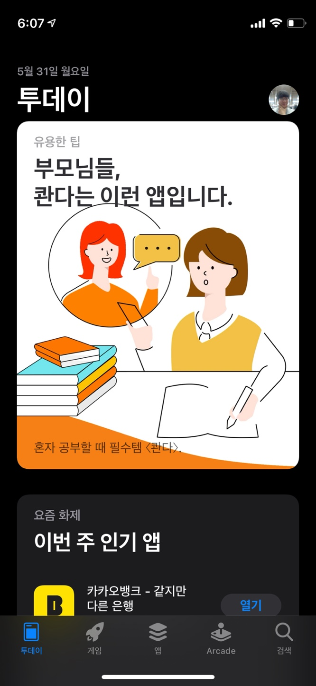
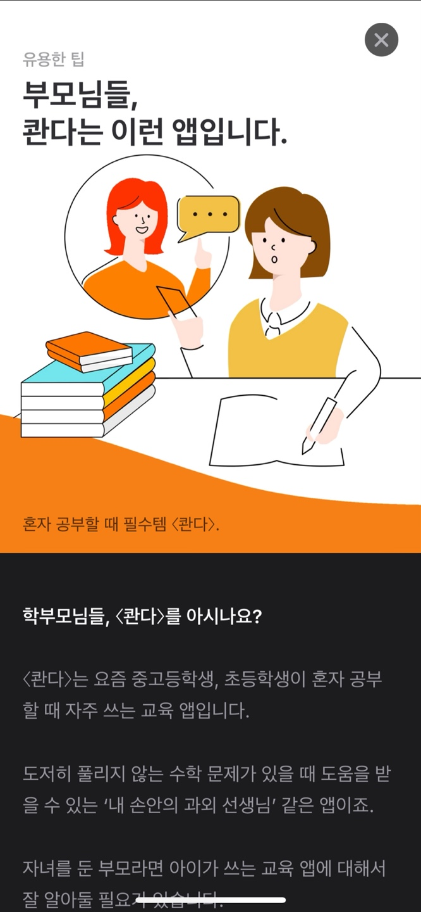
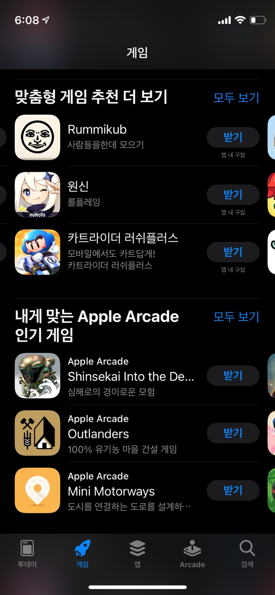
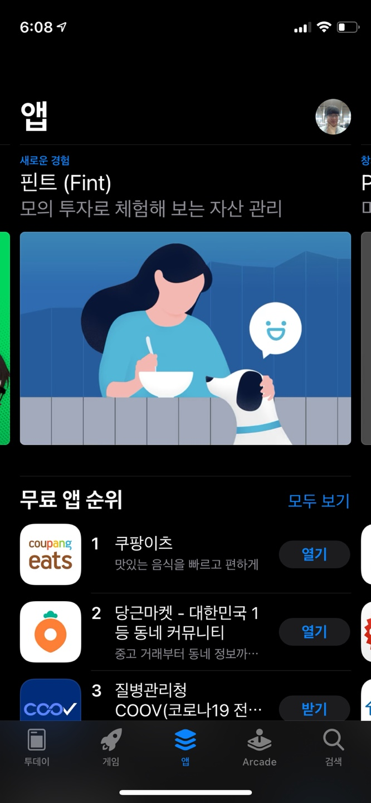
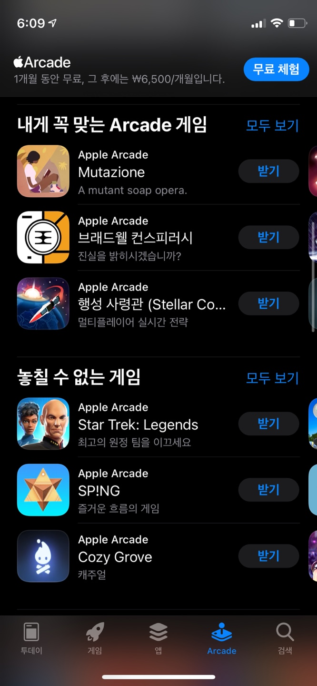
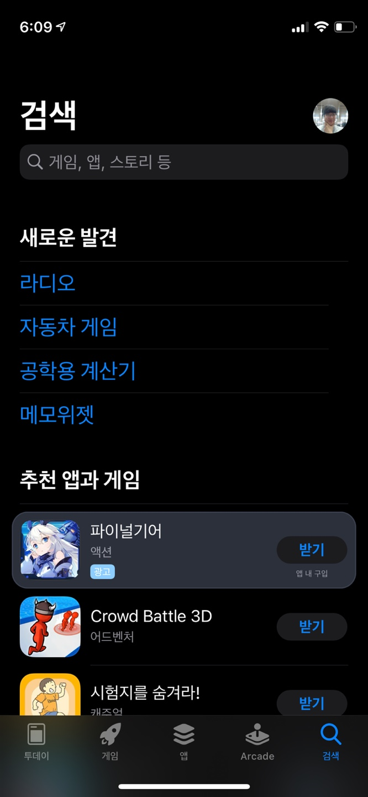
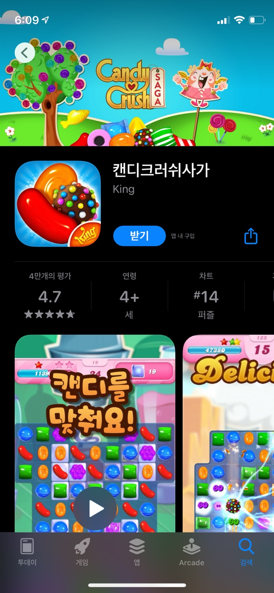

# [UXKit] 앱 탐구 생활 - App Store
개인적으로 가장 좋아하고 또 아름답다고 생각하는 앱을 리뷰해보려고 합니다.

아이폰을 쓰면서 100%의 유저들이 사용했다고 확신할 수 있는 앱 입니다. 평소에는 아무 생각 없이 쓰다가, 막상 뜯어보고 비슷하게 구현하려고 하니 생각보다 많은 기능들이 들어있음을 깨닫고 정리하면서 남겨볼까 합니다.

이 앱은 아마 기본으로 설치되어 있는 앱이라 아이폰을 사용하신다면 어렵지 않게 살펴보실 수 있을꺼에요!

## 런치뷰
애플이 만든 기본 앱들은 살펴볼수록 놀랍고, 또 그들이 제안하는 [HIG](https://developer.apple.com/design/human-interface-guidelines/ios/overview/themes/)라는 철학위에 만들어지는 것에 놀랍다고 생각합니다. 예를 들면 런치뷰의 경우에는 사용자가 기다리는 시간을 최소화 하기위해 첫 화면과 가장 유사하게 만들어야 한다고 합니다. 보통의 다른 앱들은 광고모델이 등장하거나, 앱의 로고, 이름들이 짠 하고 나오고 첫 화면으로 넘어갑니다. 그런데 애플의 이 앱스토어는 빠르기도 하지만 켜자마자 켜진다는 느낌을 받습니다. 기다리는 시간이 체감되지 않습니다. 아래 스크린 샷을 찍는 것도 힘들 정도였습니다.  

조금 더 기다리면 인디케이터가 나오기도 하지만, 첫 화면의 배경생과 같은 런치뷰를 썻기 때 문에 그 위에 무언가 나타났다는 느낌을 받았습니다.

## 앱 구성
크게 5개의 탭바로 되어있습니다.
- 투데이
- 게임
- 앱
- Arcade
- 검색

굉장히 직관적이지만, 실제 앱의 카테고리로 나누고 탭을 줄여도 되지 않았을까 라는 생각도 듭니다. 반대로 생각해보면, 앱을 소개하고 싶고, 큰 가지를 탭바로 나누어 놓은 것 처럼 생겼습니다. 트렌트에 맞는 투데이, 게임, 앱, 아케이드 앱 언제든지 애플의 운영정책에 따라 탭바의 아이콘과 내용이 바뀌어도 이상하지 않아 보입니다.  

## 투데이
홈 화면에서는 예쁜 카드들이 특정 기준에 해당하는 앱을 설명해줍니다. 인기있는 앱이나 흥미로운 아티클과 함께 앱소개가 되어 항상 보면서 이런 앱들이 새로 나왔구나 라는 정보를 얻고 있습니다. 그 와중에 이상한 곳에서 감동을 받았는데 바로 `카드클릭 애니메이션`이었습니다. 투에이에 있는 카드들을 클릭하면 상세페이지가 나오면서 굉장히 자연스러운 애니메이션으로 넘어갑니다. 기본으로 지원해주지 않으니 꼭 한번 구현해서 정리 해야겠습니다.  

## 게임, 앱, 아케이드

특별히 눈에들어오는 부분은 없지만 꼭 직접 구현해 보고 싶은 뷰 입니다. 가로로 움직이는 컬렉션 뷰와 아래로 나열되어있는 복합 구조의 뷰는 복잡하지만 일반적인 디자인이니까요.

## 검색

평소에 사용할 때는 별 생각없이 사용했었습니다. 기회가 있어서 직접 구현해 본 적이 있었는데 생각보다 엄청 많은 것들이 구현되어 있어서 놀랐습니다. 예를들면, 검색 옆의 프로필 사진이라던가, 검색어 결과에 따라 이미지들이 가로로, 세로로 보여지기도 합니다 또 별점 디테일한 요소등등 이 있습니다.

많은 것을 배울 수 있으니 잘 뜯어보고 구현해보는 것을 추천드립니다!
