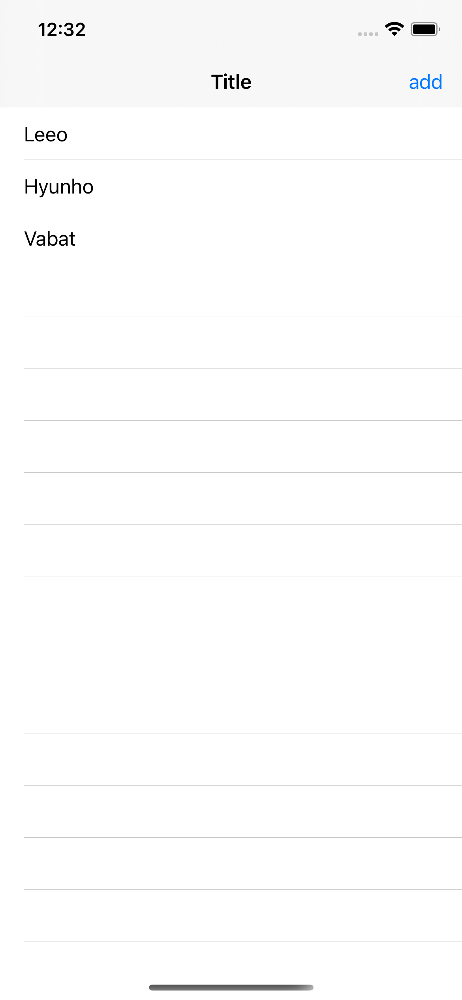
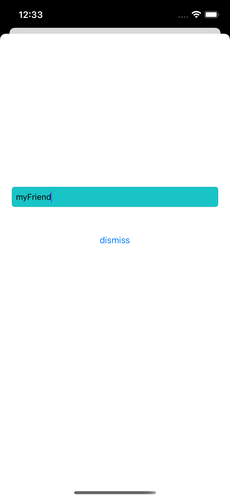
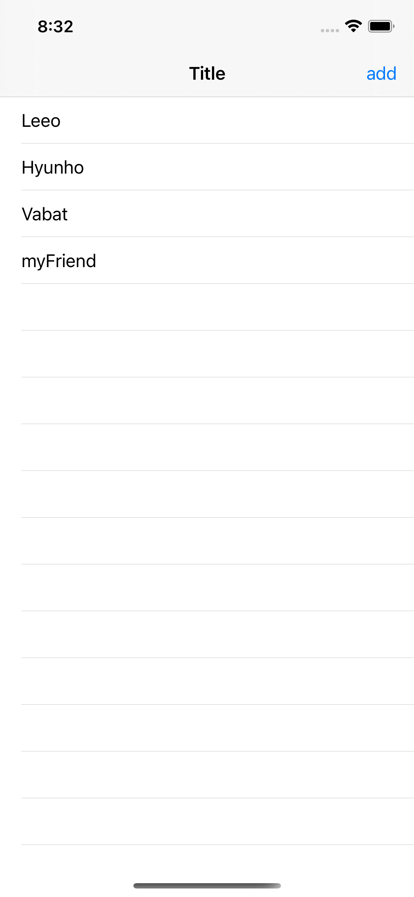

# 이벤트 핸들링이 헷갈리는 사람이 보면 좋은 글

iOS 개발을 하다보면, 내가 만든 UI에게 지금 일어나고 있는 일을 전달하고 싶을 때가 있습니다. 이 때 내가 원하는 기능을 동작하게 하는 방법은 다양합니다. 내가 하고 있는 일이 어떤 것인지, 정리 해보도록 하겠습니다.

크게 3가지 방법이 있습니다. `Notification`, `Delegate`, `closure`. 이 것들에 대한 비교는 더 자세하고 좋은 글들이 많으니 실제 사용 측면에서 보면 좋을 것 같습니다.

## 실제 환경
우리는 아래와 같은 코드가 있다고 합시다. 제가 가장 고민없이 만들 수 있는 테이블 뷰 입니다. :)
이해하는데 어렵지는 않죠? add 버튼을 누르고 nameTextField에 이름을 입력하고, 버튼을 누르면 리스트에 추가되는 구조 입니다.

```
// ViewController.swift
import UIKit

var items: [String] = ["Leeo", "Hyunho", "Vabat"]

class ViewController: UIViewController {

    @IBOutlet weak var tableView: UITableView!


    override func viewDidLoad() {
        super.viewDidLoad()
        tableView.delegate = self
        tableView.dataSource = self
    }

    @IBAction func didTapAddButton(_ sender: Any) {
        let vc = (storyboard?.instantiateViewController(identifier: "AddViewController")) as! AddViewController
        vc.parentsViewController = self
        present(vc, animated: true, completion: nil)
    }
}

extension ViewController: UITableViewDelegate, UITableViewDataSource {
    func tableView(_ tableView: UITableView, numberOfRowsInSection section: Int) -> Int {
        return items.count
    }

    func tableView(_ tableView: UITableView, cellForRowAt indexPath: IndexPath) -> UITableViewCell {
        let cell = tableView.dequeueReusableCell(withIdentifier: "myCell")
        cell?.textLabel?.text = items[indexPath.row]
        return cell!
    }
}
```

```
//AddViewController.swift

import UIKit

class AddViewController: UIViewController {
    @IBOutlet weak var nameTextField: UITextField!

    override func viewDidLoad() {
        super.viewDidLoad()

    }

    @IBAction func didTapDissmissButton(_ sender: Any) {
        items.append(nameTextField.text!)
        dismiss(animated: true)
    }
}
```

그런데 리스트에는 추가되고 나서도, 테이블 뷰가 업데이트 되지 않습니다. 우리는 이제 메인에 있는 테이블뷰에게 modal이 사라졌으니까 tableview를 reload 하라고 알려주는 방법들에 대해 알아보겠습니다.





## Closure
클로져는 어떤 행동이라고 보면 이해하기 좋습니다. 예를 들면 다음과 같습니다.
`let 아침운동 = { 뜀뛰기10회, PT체조 10회, 스쿼트50회 }`
이렇게 정의 하면 `아침운동()` 하게되면 운동을 하겠죠? 이처럼 행동을 정의한다고 이해하면 좋겠습니다.
그럼 우리는 modal이 사라지고 난 뒤에 할 일을 알려주면 됩니다.

'let completion = {테이블 뷰를 업데이트 해}'

한 번 코드로 볼까요?

```
// AddViewController.swift
import UIKit

class AddViewController: UIViewController {
    @IBOutlet weak var nameTextField: UITextField!

    var tableView: UITableView?

    override func viewDidLoad() {
        super.viewDidLoad()

    }

    @IBAction func didTapDissmissButton(_ sender: Any) {
        items.append(nameTextField.text!)
        dismiss(animated: true, completion: { self.tableView?.reloadData()} )
    }
}

```

```
// ViewController.swift
@IBAction func didTapAddButton(_ sender: Any) {
    let vc = (storyboard?.instantiateViewController(identifier: "AddViewController")) as! AddViewController
    vc.tableView = tableView
    present(vc, animated: true, completion: nil)
}
```

`AddViewController`에 테이블 뷰를 받을 수 있는 변수를 만들어주고, 버튼을 누를 때 데이터를 받습니다. 그리고 핵심은 dismiss가 되고 난 후에 실행할 completion에 취할 행동을 넣어주는 것 입니다. `{ self.tableView?.reloadData()}` == ` {테이블 뷰를 업데이트 해}`

이렇게 하면 closure를 사용해서 모달이 사라진 뒤에 테이블 뷰를 reload 할 수 있습니다.

## delegate
모달의 행동을 위임할 위임자인(delegate)를 만들어서 위임 해버립니다. 위임이라는 것을 간단하게 설명하면, 위임 받을 자는 위임할 자의 프로톨콜(약속)을 채택해야 합니다. 그래야 위임을 받을자가 자신이 무엇을 위임 받는지는 알기 때문 입니다. 그래서 위임자는 delegate: protocol을 가지고, 위임을 받은자는 `vc.delegate = self` 와 같은 위임을 통해 무슨일을 해야하는지 알 수 있습니다. 저 delegate에 self가 들어가려면 둘 다 가지고 있는 공통의 제약이 있어야 합니다.

저렇게 하고 나면 `viewController: protocol` 이렇게 직접 프로토콜을 채택해서 제약을 따라주어야 합니다.

아래 코드로 보겠습니다.

```
//  AddViewController.swift
import UIKit

protocol AddViewControllerDelegate: AnyObject {
    func willDissmiss()
}

class AddViewController: UIViewController {
    @IBOutlet weak var nameTextField: UITextField!
    weak var delegate: AddViewControllerDelegate?
    var tableView: UITableView?

    override func viewDidLoad() {
        super.viewDidLoad()

    }

    @IBAction func didTapDissmissButton(_ sender: Any) {
        items.append(nameTextField.text!)
        delegate?.willDissmiss()
        dismiss(animated: true)
    }
}
```

```
// ViewController.swift
@IBAction func didTapAddButton(_ sender: Any) {
    let vc = (storyboard?.instantiateViewController(identifier: "AddViewController")) as! AddViewController
    vc.delegate = self
    present(vc, animated: true, completion: nil)
}
```

아까와는 다르게 `AddViewControllerDelegate`이라는 protocol이 생겼습니다. 그리고 위임을 할 modal은 delegate라는 AddViewControllerDelegate를 하나 가집니다.

우리가 present 할 vc에 `delegate = self` 합니다. 이 뜻은 저 프로토콜에 할당 될 수 있어야 한다는 뜻 입니다. 그런데 이 `ViewController`는 그 제약을 가지고 있지 않으니 추가해줍니다.

```
// ViewController.swift
extension ViewController: AddViewControllerDelegate {
    func willDissmiss() {
        tableView.reloadData()
    }
}
```
그러면 저 willDissmiss는 언제 호출되는 것 일까요? `didTapDissmissButton`을 잘 보시면 `delegate?.willDissmiss()`가 호출되는 것을 볼 수 있습니다. 즉 위임 받은자는 위임한 자가 버튼이 눌릴 때 마다 구현해 놓은 `willDissmiss()`가 불리는 것 입니다.

## Notification
Notification는 노티를 등록 해 놓고, 그 노티를 날리는 것을 캣치해서 반응할 수 있습니다. 구현이 간단하고, 코드의 양도 적으니 아래 코드로 설명하겠습니다.

```
// ViewController.swift
override func viewDidLoad() {
    super.viewDidLoad()
    tableView.delegate = self
    tableView.dataSource = self

    NotificationCenter.default.addObserver(self,
                                           selector: #selector(realoadTableView),
                                           name: Notification.Name("willDissmiss"),
                                           object: nil)
}

@objc private func realoadTableView() {
    tableView.reloadData()
}
```

```
// AddViewController.swift
@IBAction func didTapDissmissButton(_ sender: Any) {
    items.append(nameTextField.text!)
    NotificationCenter.default.post(name: Notification.Name("willDissmiss"), object: nil)
    dismiss(animated: true)
}
```
테이블을 `reload`할 곳에서는 알림을 받기위한 설정을 해줍니다. `NotificationCenter.default.addObserver`를 통해 어떤 알림을 받을 것인지, 알림을 받았을 떄 어떤 메소드를 실행할 것 인지를 설정해주는 것이죠.

그리고 `NotificationCenter.default.post`를 통해 알림을 보내줍니다. 다른 객체도 같이 보낼 수 있지만 이번에는 알림만 보내는 간단한 예를 들어 보았습니다.

## 정리
처음에 앱을 구현할 때는 돌아가는 방법을 검색해서 그대로 따라서 구현했습니다. 그리고 나서는, 지난번에 했던 방법과 다른 방법이 있어서 헷갈리기 시작했습니다. 이렇게 해도 동작하고 저렇게 해도 동작하기 때문이었죠. 그리고 이 다음은 언제 어떤 방법을 골라야 하는지 알고 골라야 할 것 입니다. 구글에는 `Notification`, `Delegate`, `closure` 차이점을 비교하는 많은 글들이 있습니다. 어떻게 쓰는지 알았으니 이제 골라서 구현하면 됩니다.


ㅇㅇㅇ
